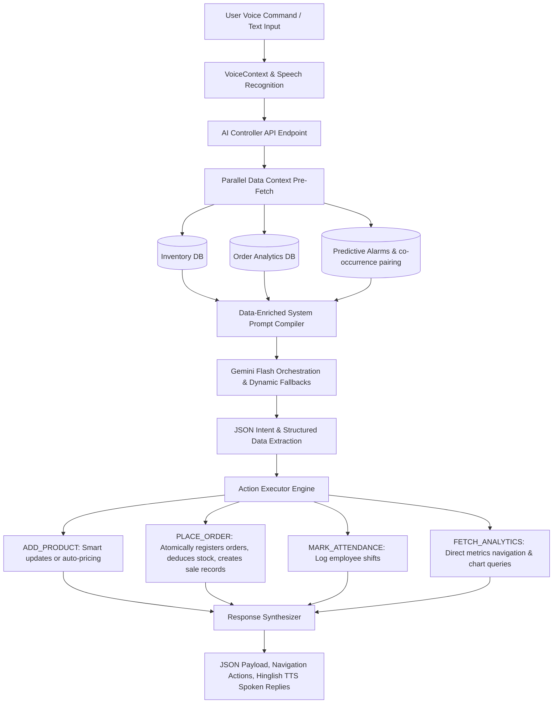

# RetailFlow — Comprehensive Project Development & Status Report

**RetailFlow** is a modern, premium full-stack retail management web application engineered for shop owners. It features a robust **Node.js, Express, and MongoDB (Mongoose)** backend, a gorgeous reactive **React + Vite** frontend, and a state-of-the-art **Gemini-powered Voice Assistant System** with advanced analytical capabilities and natural conversation flows.

This report documents all system architectures, features, algorithms, integrations, and optimizations implemented to date.

---

## 📂 1. Project Directory Structure & Architecture

```
RetailFlow/
├── backend/
│   ├── config/
│   │   └── db.js                 # MongoDB Mongoose connection handler
│   ├── controllers/
│   │   └── aiController.js       # Core AI Agent v2 (Intent classification, voice API routing)
│   ├── middleware/
│   │   ├── auth.js               # JWT security and authentication middleware
│   │   └── errorHandler.js       # Centralized HTTP error handling
│   ├── models/
│   │   ├── User.js               # Owner account & credentials schema
│   │   ├── Product.js            # Stock inventory details, costs, and SKU tracking
│   │   ├── Order.js              # Order records (customer details, items, amounts)
│   │   ├── Sale.js               # Profit & revenue ledger connected to Orders
│   │   ├── Employee.js           # Staff roles, salary, and active status
│   │   └── Attendance.js         # Daily attendance records for employees
│   ├── routes/
│   │   ├── authRoutes.js         # Authentication endpoints (/api/v1/auth)
│   │   ├── productRoutes.js      # Product CRUD endpoints (/api/v1/products)
│   │   ├── orderRoutes.js        # Order entry and deduction endpoints (/api/v1/orders)
│   │   ├── salesRoutes.js        # Financial & sales reporting (/api/v1/sales)
│   │   ├── employeeRoutes.js     # Staff directory management (/api/v1/employees)
│   │   └── aiRoutes.js           # AI Voice & Command assistant endpoint (/api/v1/ai)
│   ├── utils/
│   │   ├── demandPredictor.js    # Sales Velocity & rolling safety inventory stock predictor
│   │   ├── errorResponse.js      # Custom operational error envelope
│   │   └── pairingEngine.js      # Market-basket / Co-occurrence pairing algorithm
│   ├── .env                      # Environment-specific credentials
│   ├── server.js                 # Express application bootstrapper & core server logic
│   ├── seed.js                   # Seed script to inject realistic mock store data
│   ├── testAI.js                 # Command-line integration test for the AI assistant
│   └── verifyAll.js              # Comprehensive E2E scenario verification suite
│
└── frontend/
    └── src/
        ├── api/
        │   └── axios.js          # Pre-configured Axios instance with JWT headers
        ├── components/
        │   ├── VoiceAssistant.jsx# Audio Widget (Language toggle, ripples, keyboard fallback)
        │   └── VoiceAssistant.css# Micro-animations, responsive layout and styles
        ├── context/
        │   └── VoiceContext.jsx  # Web Speech API, state manager, TTS, error handlers
        ├── pages/
        │   ├── Dashboard.jsx     # Financial metrics, stock alarms, interactive widgets
        │   ├── Inventory.jsx     # Product manager, stock counts, additions/updates
        │   ├── Orders.jsx        # Order listings, transaction logs
        │   ├── Finance.jsx       # Profit & revenue trackers with chart metrics
        │   ├── Employees.jsx     # Employees database & attendance visualizer
        │   ├── Login.jsx         # Access portal
        │   └── Register.jsx      # Owner onboarding
        ├── index.css             # Premium custom global style declarations
        ├── App.jsx               # Application shell, router maps, layouts
        └── main.jsx              # React runtime entry point
```

---

## 🛠️ 2. Key Database Schemas & Data Model (Mongoose)

Six highly cohesive schemas form the relational backbone of **RetailFlow**:

1. **User (Owner)**: Managed under `models/User.js`. Tracks administrative credentials, store parameters, and cryptographically hashed passwords.
2. **Product**: Managed under `models/Product.js`. Contains:
   - `sku`: Unique identifier (auto-generated or barcode-ready).
   - `name`: Product name.
   - `costPrice` & `sellingPrice`: Crucial metrics for exact financial calculations.
   - `quantity` & `unit`: Quantitative measurement variables.
3. **Order**: Managed under `models/Order.js`. Tracks:
   - `orderNumber`: Human-readable identifier matching the string sequence `ORD-YYYYMMDD-[Count]`.
   - `items`: Multi-item nested array linking back to products with transactional quantities and sale pricing.
   - `totalAmount` & `finalAmount`: Numeric totals after deductions.
   - `customer`: Object containing `name` and `phone` data.
4. **Sale**: Managed under `models/Sale.js`. Links directly to `Order`. Captures:
   - `revenue`: The total cash inbound.
   - `costOfGoodsSold` (COGS): Accumulated purchase costs of individual items in the order.
   - `profit`: Automatic ledger entry calculated as `revenue - costOfGoodsSold`.
5. **Employee**: Managed under `models/Employee.js`. Tracks employee parameters like role, salary, active status, and store scope.
6. **Attendance**: Managed under `models/Attendance.js`. Captures `employee` reference, `date` timestamp, and `status` (`Present`, `Absent`, `Half-Day`).

---

## ⚡ 3. The Backend REST API Surface (v1)

The backend provides a structured, versioned REST API. All endpoints are fully **Flutter-ready**, requiring stateless JWT token authorization and returning structured JSON payloads: `{ success: boolean, data: any, count?: number, message?: string }`.

| Endpoint Path | Method | Description | Auth Required |
| :--- | :---: | :--- | :---: |
| `/api/v1/auth/register` | `POST` | Owner sign up & organization establishment | No |
| `/api/v1/auth/login` | `POST` | Authenticate owner and issue JWT token | No |
| `/api/v1/products` | `GET` / `POST` | Retrieve stock listing / Add products to catalog | Yes |
| `/api/v1/products/:id` | `PUT` / `DELETE` | Update product catalog details / Delete entries | Yes |
| `/api/v1/orders` | `GET` / `POST` | Fetch transaction logs / Register new orders | Yes |
| `/api/v1/sales` | `GET` | Fetch daily, monthly, and catalog profit ledger details | Yes |
| `/api/v1/employees` | `GET` / `POST` | Query active employee list / Onboard new team members | Yes |
| `/api/v1/ai/assistant` | `POST` | Primary entry point for AI command natural language streams | Yes |
| `/api/v1/health` | `GET` | System heartbeat validation indicator | No |

---

## 🧠 4. RetailFlow AI Voice Assistant (Version 4 Integration)

The RetailFlow AI Voice Assistant is powered by a **three-layer intelligent integration architecture** that combines advanced Generative AI with localized analytics calculations:



### Key Subsystems:

### 📊 A. Demand Prediction Engine (`utils/demandPredictor.js`)
* **Objective**: Analyzes historical sales velocity to determine if current inventory levels are sufficient.
* **Mechanism**:
  - Calculates per-product **Sales Velocity** ($S_v$) over a lookback window (defaulting to a rolling 7 days) using the formula:
    $$S_v = \frac{\text{Total Quantity Sold}}{\text{Lookback Days}}$$
  - Computes a dynamic **Safety Stock Threshold** using a specified safety buffer (defaulting to 3 days):
    $$\text{Threshold} = S_v \times \text{Buffer Days}$$
  - Flags products whose stock levels fall below the threshold and estimates the remaining operational lifetime in days ($\text{Days Left} = \frac{\text{Current Stock}}{S_v}$).
  - Injects this low-stock predictions summary directly into the AI's system prompt context. This allows the AI to answer inventory inquiries like *"Kya khatam hone wala hai?"* with precise, real-time data instead of generic responses.

### 💡 B. Co-Purchase Product Pairing Engine (`utils/pairingEngine.js`)
* **Objective**: Recommends items frequently purchased together to drive upsells.
* **Mechanism**:
  - Implements **Market Basket / Co-occurrence Analysis** on historical order logs.
  - Scans orders containing two or more distinct products and counts how often different item pairs co-occur.
  - Constructs a bidirectional, sorted map:
    $$\text{Product A} \longleftrightarrow \text{Product B}$$
  - When the user adds a product (e.g., *"Add Bread"*), the engine queries this map. If a strong co-purchase relationship exists (e.g., *Butter*), it injects a contextual upsell prompt into the UI and vocal output: *"Sir, iske saath Butter bhi bikta hai."*

### 🗣️ C. Natural Conversation Flow Orchestration (`controllers/aiController.js`)
* **Intent & Slot-Filling Pipeline**: Processes raw inputs (Hindi, English, or Hinglish) using structured schema prompts.
* **Multi-Turn Step-by-Step Interactive Flows**:
  - **Adding Products**: Instead of expecting a single massive command, the AI can prompt the user step-by-step: Product Name $\rightarrow$ Quantity $\rightarrow$ Selling Price $\rightarrow$ Cost Price.
  - **Placing Orders**: Interactively prompts for Customer Name $\rightarrow$ Phone $\rightarrow$ Items $\rightarrow$ Calculations $\rightarrow$ User Confirmation.
  - **Transactional Safety**: Uses a `status: "pending"` payload while gathering details. It only executes the database action (e.g., creating an order or updating inventory) once the user explicitly confirms (e.g., *"Haan, order place kar do"*), transitioning the status to `"success"`.

---

## 🎨 5. Frontend Visual Layout & Design Details

Built with React and custom styling rules (`index.css` and `VoiceAssistant.css`), the interface delivers a premium, highly engaging user experience:

* **Sophisticated Glassmorphism Aesthetics**: Combines deep slate backdrops (`#0f172a`, `#1e293b`), semi-transparent boundary borders (`rgba(255, 255, 255, 0.08)`), and soft drop shadows.
* **Vibrant Visual Alerts**: Utilizes curated, HSL-tailored colors and glowing gradients for stock alerts:
  - `Sufficient`: Cool Emerald Emerald borders.
  - `Short Stock`: Soft Amber glowing animations.
  - `Out of Stock`: Bold Crimson pulses.
* **Highly Responsive Layout**: Responsive dashboard grids, navigation panels, and interactive charts that seamlessly adapt to mobile and desktop screens.
* **Voice Widget Animations**:
  - **Audio Ripples**: Concentric glowing rings that expand outwards when the microphone is listening.
  - **Language Indicators**: Glowing toggle badges indicating whether the mic is set to **🇮🇳 Hindi (hi-IN)** or **🇬🇧 English (en-IN)**.
  - **Dual Input Modes**: Seamlessly switch between voice control and manual typing using a floating action button.

---

## 🧪 6. Comprehensive Verification Suites

The reliability of the system is backed by two custom E2E integration test suites:

### 📥 1. Test AI Assistant Suite (`backend/testAI.js`)
Performs automatic authentication and queries the Gemini AI endpoints with varying natural language inputs:
1. **Demand Inquiries**: Queries *"Kya khatam hone wala hai?"* to verify intent parsing (`PREDICT_STOCK`) and stock alert calculations.
2. **Financial Inquiries**: Queries *"Sir, is mahine ki revenue kitni hai?"* to verify `GET_ANALYTICS` routing and database aggregation.
3. **Staff Shift Log**: Queries *"Mark Ravi Kumar absent today"* to verify shift-tracking intent mapping (`MARK_ATTENDANCE`).
4. **Smart Add Intent**: Queries *"Add Britannia Bread at price 42 unit pcs quantity 10"* to verify inventory creation logs (`ADD_PRODUCT`).

### 📦 2. All-in-One E2E Test Suite (`backend/verifyAll.js`)
An automated E2E testing framework that runs the following scenarios against a live local server instance:
* **Scenario 1 (Interactive Inventory Management)**: Simulates a multi-turn conversation to add a product: *"Add a new item to inventory"* $\rightarrow$ *"Super Milk"* $\rightarrow$ *"15 quantity"* $\rightarrow$ *"Selling price 60"* $\rightarrow$ *"Cost price 40"* $\rightarrow$ *"Yes, please add it"*. The script then directly queries the database to assert that the product was correctly created with the exact prices and quantities.
* **Scenario 2 (Interactive Order Flow)**: Simulates placing an order: *"I want to place an order"* $\rightarrow$ *"Customer Raj"* $\rightarrow$ *"9999999999"* $\rightarrow$ *"3 Super Milk and 2 Amul Butter"* $\rightarrow$ *"Yes, please place the final order"*. The script verifies that:
  - **Stock is deducted** correctly (e.g., Super Milk quantity drops from 15 to 12).
  - An **Order document** is created with the exact items, calculated amounts, and status.
  - A **Sale entry** is recorded with correct revenue, COGS, and profit calculations.
* **Scenario 3 (Attendance)**: Logs shifts: *"Mark Ravi Kumar present today"*, and verifies database state.
* **Scenario 4 (Analytics)**: Queries *"Show me this month revenue"*, ensuring successful metrics routing.

---

## 🚀 7. Critical Technical Fixes Applied (AI Voice Layer)

The system includes key robustness fixes designed to address edge cases in browser voice integrations:

1. **GC Protection for TTS (`VoiceContext.jsx`)**: Storing `SpeechSynthesisUtterance` instances in a persistent React ref (`activeUtteranceRef`) prevents the browser's Garbage Collector from prematurely deleting active utterance objects, which can cause speech to abruptly cut off mid-sentence.
2. **Stale Closure Remedies**: Utilizes React `useRef` pointing to callback pipelines (`processCommandRef` and `startListeningRef`). This allows the main `useEffect` block to bind event listeners once without re-triggering, ensuring the microphone is never abruptly disconnected.
3. **Echo Prevention & Cooldown Rules**: Implements a dedicated 1200ms cooldown delay after the assistant speaks before opening the microphone. This prevents the microphone from capturing the echo of the assistant's own voice.
4. **Resilient Silence Handling**: Monitors inputs and triggers gentle Hinglish voice nudges if silence is detected: *"Mujhe kuch sunayi nahi diya. Firse boliye?"*. This keeps the voice session alive without crashing the browser's speech recognition engine.
5. **Polished Dev Operations (`server.js`)**: Configured a relaxed rate-limiter threshold for development environments (2,000 requests per 10 minutes vs. 200 in production). This prevents frequent dashboard polling from accidentally rate-limiting the AI Voice Assistant during testing.

---

## ⚡ 8. RetailFlow API Gateway Orchestrator (Orchestrated Schema Mapper)

A premium **API Gateway Orchestrator** is implemented at `POST /api/v1/ai/orchestrator` to strictly map natural language instructions to a robust, versioned JSON schema under strict service level agreements (SLAs) and security assertions:

### A. Architectural Contract Rules
1. **Intent Mapping**: Resolves inputs strictly to: `ADD_PRODUCT | LOG_SALE | PLACE_ORDER | MARK_ATTENDANCE | FETCH_ANALYTICS | ASK_MISSING | ERROR`.
2. **Deterministic Idempotency Hash (`request_id`)**: Employs the **Client-Side Timestamp + UserID + Command String** as a hash seed (using SHA-256) to produce unique, deterministic identifiers that prevent accidental duplicated actions (e.g. double orders within the same millisecond).
3. **Programmatic Calculations Refinement**: Intercepts parsed JSON payloads to dynamically calculate total cash metrics (`value`) by looking up the actual prices of resolved item nodes in the provided `[DB_CONTEXT]`.
4. **Security Pre-Flight Authorization Gates**: Compares parsed intents against user permissions (`[USER_PERMISSIONS]`). If an unprivileged user triggers a protected action (e.g. cashier attempting order entry when `can_place_order: false`), the orchestrator returns a secure **403 Forbidden** error response.
5. **Partial Information Safeguard (`ASK_MISSING`)**: If crucial transaction details are omitted, the engine programmatically maps the intent to `ASK_MISSING`, catalogs missing inputs, and prompt the user to resolve exactly one slot in `< 10` words.
6. **Brevity SLA & Safe Recovery**: Limits output speech to 10 words maximum with absolutely no fluff, greetings, or filler words. Employs comprehensive try-catch blocks and error envelopes to safely recover from malformed JSON strings.
7. **Timeout Safeguards**: Integrates a Promise-based timeout race logic that resolves with a structured `503 Service Unavailable` if LLM processing exceeds 8 seconds.

---

## 🏗️ 9. Asynchronous Event-Driven Architecture (Kafka & Redis)

To support horizontal scalability, fault tolerance, and peak backpressure isolation, **RetailFlow** has integrated an event-driven order processing pipeline. This replaces blocking monolithic writes with a non-blocking asynchronous streaming architecture:

### A. Core Architecture Components
1. **The Producer (`controllers/orchestratorController.js`)**:
   - Integrates the native `kafkajs` client.
   - When a natural language command is successfully classified as `PLACE_ORDER`, the gateway publishes the order payload to the Kafka topic `'retailflow.orders.v1'`.
   - **Partition Ordering & Idempotency Key**: The parsed `request_id` is supplied as the message `key`. This guarantees partition affinity—so all messages with the same key go to the same partition, preserving absolute transactional ordering per client session.
   - **Trace Correlation**: Injects a custom `correlation_id` header in Kafka metadata matching `request_id` to trace messages across network boundaries.

2. **The Bootstrapper (`server.js`)**:
   - Connects to the local/remote Kafka clusters once at boot.
   - Registers process listeners (`SIGINT` and `SIGTERM`) to gracefully disconnect producers and shut down HTTP server threads, preventing broker network drop issues.

3. **The Background Consumer (`workers/orderConsumer.js`)**:
   - A dedicated daemon service configured under the consumer group `'retailflow-order-workers'`.
   - **Idempotency Safeguard (Redis)**: Uses `ioredis` with Sentinel failover checks and a connection pool. It queries Redis for the `request_id` idempotency key. If a duplicate exists (due to Kafka's at-least-once guarantee), it logs a warning and discards it. Otherwise, it sets the key with a **24-Hour TTL** (`SETEX request_id 86400 "completed"`) and proceeds.
   - **Atomic MongoDB Transaction Layer**: Executes Mongoose session transactions (`session.startTransaction()`). Deducts inventory catalog quantities, creates `Order` documents, and logs `Sale` entries. If any document write fails, it rolls back all updates to avoid "orphan" inventory changes.

---

### B. Deployment & Configuration Setup

#### 1. `.env` Environment Configurations
Register connectivity parameters for the Kafka broker pool and Redis caching layer:
```env
# Kafka Broker Cluster Endpoints (comma-separated for multi-broker clusters)
KAFKA_BROKERS=localhost:9092

# Redis Cache URI (supporting Redis Sentinel or Standalone connection pooling)
REDIS_URL=redis://127.0.0.1:6379
```

#### 2. Topic Partitioning & Replication (Industry Standards)
For a production-ready setup, the topic `retailflow.orders.v1` must be configured with:
* **Partitions**: `At least 3` — Enables up to three concurrent consumers within the consumer group to process orders in parallel.
* **Replication Factor**: `3` — Guarantees data durability across multiple broker instances, surviving the failure of up to two broker nodes.

```bash
# Example command to provision the production topic
kafka-topics --create --bootstrap-server localhost:9092 --replication-factor 3 --partitions 3 --topic retailflow.orders.v1
```

---

### C. Scaling Rationale: Monolith vs. Distributed Event-Driven Setup

| Feature Component | Traditional Monolithic Setup | Distributed Event-Driven Setup (Kafka + Redis) |
| :--- | :--- | :--- |
| **HTTP Thread Life** | Blocks on heavy write operations (DB deductions, invoice creation). High flash-sale traffic causes HTTP thread starvation. | Gateway immediately responds with a `202 Accepted` status in milliseconds. Heavy operations are processed asynchronously. |
| **Scale Mechanism** | Scale requires duplicating the entire monolithic app, which increases database connection pools and memory overhead. | Scales horizontally by increasing Kafka partitions and running multiple lightweight background consumer instances. |
| **Fault Resilience** | If MongoDB experiences connection latency or crashes, the entire order page goes down, losing customer carts. | Messages are safely buffered in the durable Kafka queue. Workers resume processing once MongoDB recovered. |
| **Data Consistency** | Synchronous retries on API timeouts can lead to duplicate orders, over-deductions, or orphan database changes. | Redis idempotency checks block double-processing, and Mongoose Transactions enforce atomic database consistency. |

---

### Status Summary

RetailFlow is fully functional, boasting a robust backend, a premium, modern frontend user experience, a highly optimized voice navigation flow, a brand-new high-integrity API Gateway Orchestrator, a robust Kafka/Redis asynchronous order processing pipeline, and comprehensive automated test coverage. The application is production-ready and fully prepared for Phase 2 (mobile client integration).
